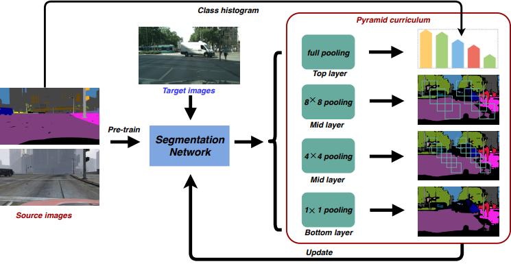

# PyCDA
Code for Constructing Self-motivated Pyramid Curriculums for Cross-Domain Semantic Segmentation: A Non-Adversarial Approach. 
## Paper
[Constructing Self-motivated Pyramid Curriculums for Cross-Domain Semantic Segmentation: A Non-Adversarial Approach](https://arxiv.org/abs/1908.09547) <br />
Qing Lian, Fengmao Lv, Lixin Duan, Boqing Gong<br />
The IEEE International Conference on Computer Vision (ICCV) 2019.

Please cite our paper if you find it useful for your research.

```
@InProceedings{Lian_2019_ICCV,
author = {Lian, Qing and Lv, Fengmao and Duan, Lixin and Gong, Boqing},
title = {Constructing Self-Motivated Pyramid Curriculums for Cross-Domain Semantic Segmentation: A Non-Adversarial Approach},
booktitle = {The IEEE International Conference on Computer Vision (ICCV)},
month = {October},
year = {2019}
}
```


## Framework


## Enviorment
The code is developed under the following configuration.
#### Hardware:
4-8 GPUs(With at least 11G GPU memories), which is set for the correspoinding batch size. 

#### Software:
Python(3.6) and Pytorch(0.4.1) is necessary before running the scripts. To install the required pythonn packages(expect Pytorch), run 

```
pip install -r requirements.txt
```

## Datasets

To train and validate the network, this repo use the [GTAV]() or [SYNTHIA]() as the source domain dataset and user [Cityscapes]() as the target domain dataset.

To monitor the convergence of the network, we split 500 images out of Cityscapes training dataset as our validation set and test on Cityscapes valdiation set.
You can check it in the ```./dataset/cityscapes_list/directory```.

To train on your own enviorment, please download the dataset and modify the dataset path in the corresponding cfgs docunment.
Downloaded [pretrained model](https://drive.google.com/drive/folders/1EgpKK5GwmFNM3XkyNHPtj52ZwDiogRMB?usp=sharing)


## Training

### Source only
```
sh run.sh train_source_only.py cfgs/source_only_exp001.yaml
```

### [Adabn]()
```
sh run.sh train_adabn.py cfgs/adabn_exp001.yaml
```

### [PyCDA]()
```
sh run.sh train_pycda.py cfgs/pycda_exp001.yaml
```

### [PyCDA + Spatial ratio]()
```
sh run.sh train_pycda_spatial.py cfgs/pycda_spatial_ratio_exp001.yaml
```

We convert the batchnorm statistics from source domain to target domain after optimization. 
### Convert batchnorm statistics
```
sh run.sh test_adabn.py $your_script
```

After adding the spatial ratio from  source domain, one could get around 47.7 - 48.2 mIoU  on Cityscapes validations set with the same iterations.

## Performance (GTAV-> Cityscapes)


## Quantitative Results


## License

This project is licensed under the MIT License - see the [LICENSE.md](LICENSE.md) file for details


## Acknowledgement
This code is heavily borrowed from [Semantic-segmentation-pytorch](https://github.com/CSAILVision/semantic-segmentation-pytorch), [AdaptSeg](https://github.com/wasidennis/AdaptSegNet), and [CBST](https://github.com/yzou2/CBST)

